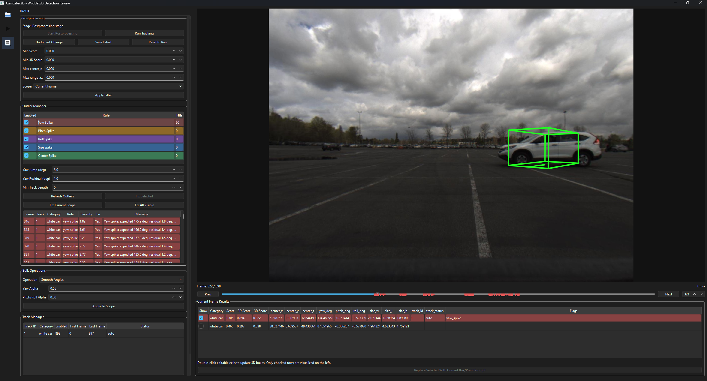

# CamLabel3D

CamLabel3D is a desktop annotation and postprocessing tool for camera-only 3D bounding boxes built on top of WildDet3D.



The current workflow is split into two stages:

1. Detection stage: run promptable single-frame 3D detection on images or video.
2. Postprocessing stage: review boxes, edit 9DoF geometry, rerun offline tracking, inspect outliers, and save curated CSV results.

## Repository Layout

```text
CamLabel3D/
├── camlabel3d/          # Layered desktop app, application services, core and IO
├── workers/             # Vendored WildDet3D code and related worker scripts
├── configs/             # Local dataset/source configuration
├── ckpts/               # Local model checkpoints (not committed)
├── docs/                # Setup and usage documentation
├── tests/               # Unit tests
├── pyproject.toml        # Package, test, and lint configuration
├── ui.py                 # Convenience desktop launcher
└── run_camlabel3d_postprocess.py
```

## Quick Start

1. Create and activate the Python environment.
2. Install dependencies.
3. Download the required checkpoints into `ckpts/`.
4. Edit `configs/dataset_sources.json` for your local datasets.
5. Launch the UI:

```powershell
python -m camlabel3d
```

The repository-level convenience launcher is equivalent:

```powershell
python .\ui.py
```

The postprocessing CLI can be inspected with either entrypoint:

```powershell
python -m camlabel3d.postprocess_cli --help
python .\run_camlabel3d_postprocess.py --help
```

For a step-by-step Windows setup, see [docs/INSTALL_CAMLABEL3D.md](docs/INSTALL_CAMLABEL3D.md).

For checkpoint download instructions, see [docs/CHECKPOINTS.md](docs/CHECKPOINTS.md).

For module boundaries, concurrency rules, and runtime resource controls, see [docs/ARCHITECTURE.md](docs/ARCHITECTURE.md).

## Configuration

- Runtime dataset/source config: `configs/dataset_sources.json`
- Example template for version control: `configs/dataset_sources.example.json`
- Default result output root: `annotation_results/`

The repository ignores the local `configs/dataset_sources.json` file because it usually contains machine-specific dataset paths.

## Notes

- WildDet3D is vendored under `workers/WildDet3D`.
- CamLabel3D now resolves WildDet3D from `workers/WildDet3D` and checkpoints from the repository-level `ckpts/` directory by default.
- Checkpoints, generated annotations, and local dataset paths are intentionally excluded from version control.
- Runtime dependencies are installed explicitly as described in the Windows setup guide; the root package metadata intentionally does not duplicate the upstream WildDet3D dependency stack.
